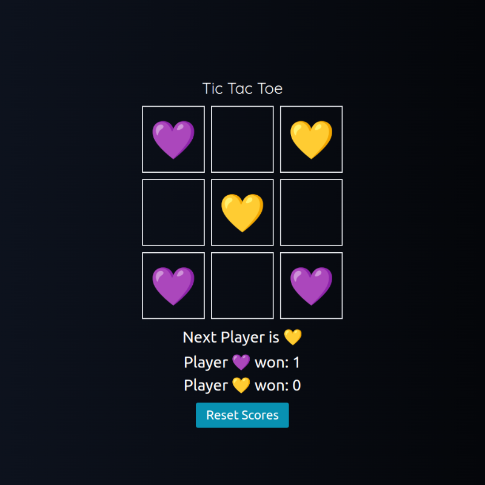

# 💜 Tic Tac Toe 💛
## Mini Application for TypeScript / React Vite Practice

### Tools I used
  
  
  
  
  
  
  
  

This project is a Tic Tac Toe game developed using React, Tailwind CSS, Vite, and deployed on Vercel.   
 

## Features

- Tic Tac Toe game with player turns and score tracking
- Utilizes React for the front-end UI
- Styled using Tailwind CSS for a clean and responsive design
- Built and optimized using Vite for rapid development and efficient code compilation
- Deployed on Vercel for a scalable, reliable, and performant hosting environment  

### Enjoy playing Tic Tac Toe!   
Sharpen your strategy and have fun with this classic game🎮   
Feel free to contribute to this project and make it even better!

Thank you for checking out this project!   
If you have any questions or suggestions, please reach out🚀   
Play now 🕹 [Tic Tac Toe](https://tic-tac-toe-yukosuga.vercel.app/)